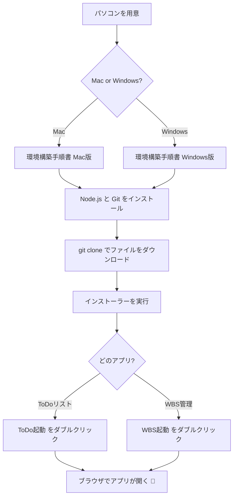
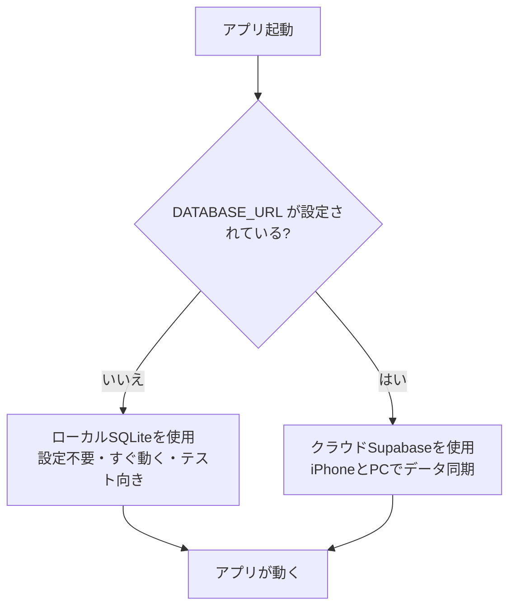
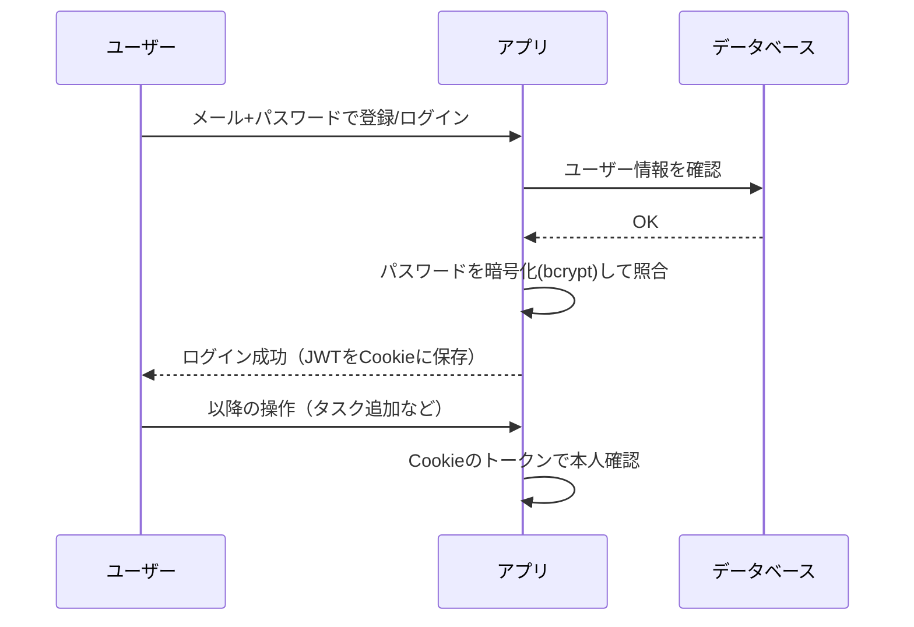
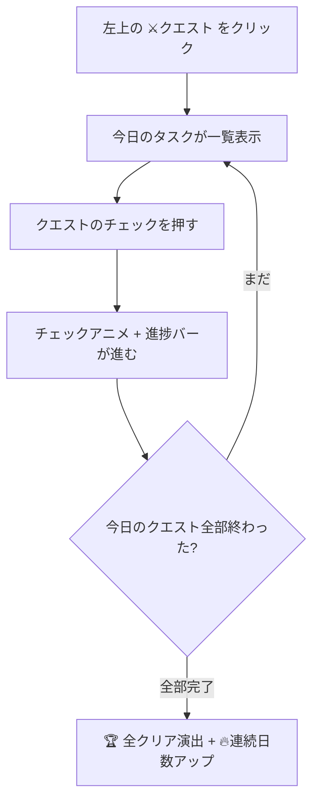
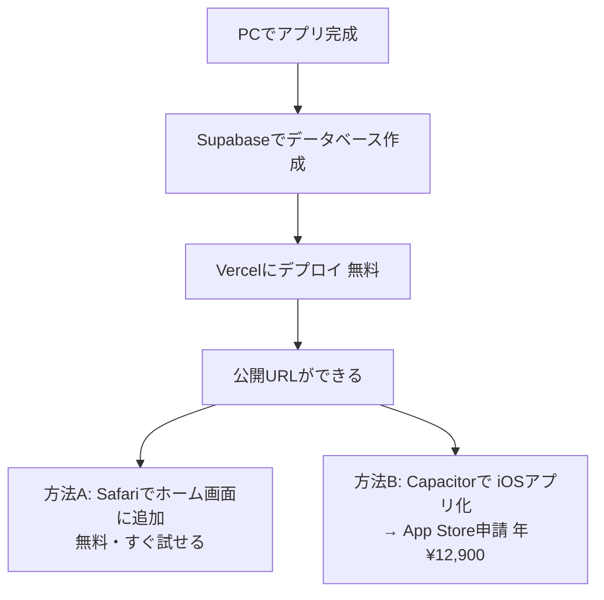

# 🗺 全体フロー図

文章だけだと分かりにくいので、**図**でまとめました。
（GitHub 上で見ると自動で図が描画されます）

---

## 1. はじめての導入フロー（PC）



---

## 2. アプリの仕組み（全体構成）

```mermaid
flowchart LR
    subgraph ブラウザ[🌐 ブラウザ / iPhone]
      UI[画面 React]
    end
    subgraph サーバー[⚙️ Next.js サーバー ポート3000]
      TODOS[/todos ToDoリスト]
      WBS[/dashboard WBS管理]
      API[APIルート]
      AUTH[ログイン認証 JWT]
    end
    subgraph データ[🗄 データベース]
      SQLITE[(ローカル SQLite app.db)]
      SUPA[(クラウド Supabase)]
    end

    UI -->|操作| API
    API --> AUTH
    API -->|DATABASE_URL なし| SQLITE
    API -->|DATABASE_URL あり| SUPA
```

> **ポイント：** ToDoとWBSは**同じアプリ**（ポート3000）で動きます。
> 設定（DATABASE_URL）の有無でDBを自動切り替えします。

---

## 3. データベース切り替えの判定



---

## 4. ログインの流れ



---

## 5. クエストログ（ゲーム化）の流れ



---

## 6. iPhone / App Store への道のり


